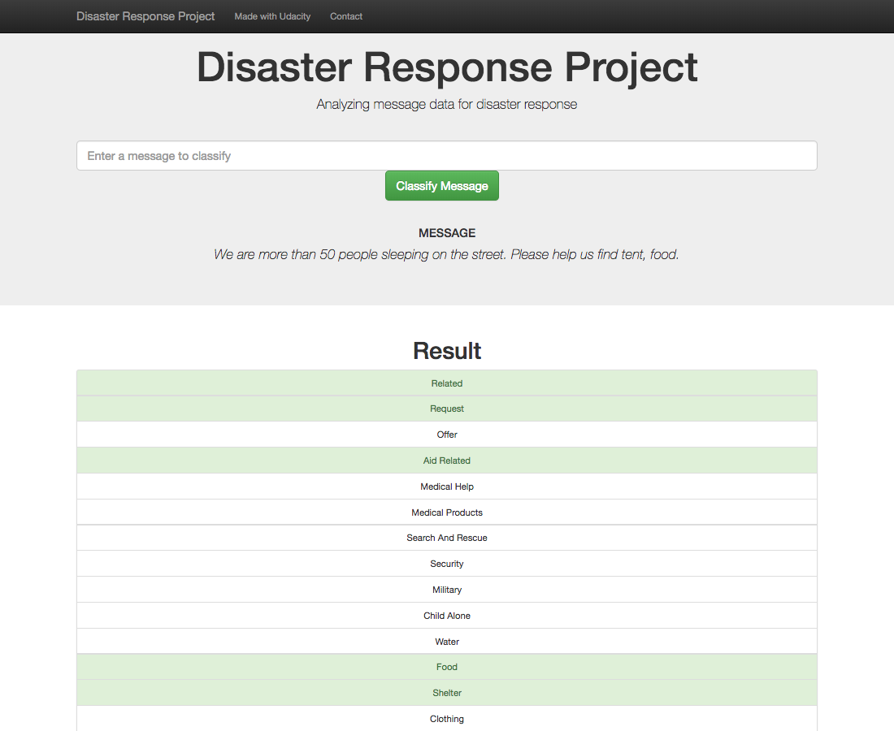

# Disaster Response Pipeline Project 
 ## Introduction
 This project will include a web app where an emergency worker can input a new message and get classification results in several categories. The web app will also display visualizations of the data.

<div align = center>


</div>

## ⚙️ Instructions
1. Run the following commands in the project's root directory to set up your database and model.

    - To run ETL pipeline that cleans data and stores in database
        
        ```
        python data/process_data.py data disaster_messages.csv data/disaster_categories.csv data/DisasterResponse.db
        ```
    - To run ML pipeline that trains classifier and saves
        ```
        python models/train_classifier.py data/DisasterResponse.db models/classifier.pkl
        ```

2. Go to `app` directory: `cd app`

3. Run your web app: `python run.py`

4. Click the `PREVIEW` button to open the homepage

## 🚧 Folder Structure
```
- app
| - template
| |- master.html  # main page of web app
| |- go.html  # classification result page of web app
|- run.py  # Flask file that runs app

- data
|- disaster_categories.csv  # data to process 
|- disaster_messages.csv  # data to process
|- process_data.py
|- InsertDatabaseName.db   # database to save clean data to

- models
|- train_classifier.py
|- classifier.pkl  # saved model 

- notebook
|- categories.csv
|- messages.csv
|- ETL Pipeline Preparation.ipynb
|- ML Pipeline Preparation.ipynb
- README.md
```

## 📝 Feedback

If you have any feedback or ideas to improve this project, feel free to contact me via my email at nduongthucanh@gmail.com or:

<a href="https://www.linkedin.com/in/ndleah/">
  

</a>
<a href="https://github.com/ndleah">
  
</a>

___________________________________

<p>&copy; 2024 Leah Nguyen</p>
